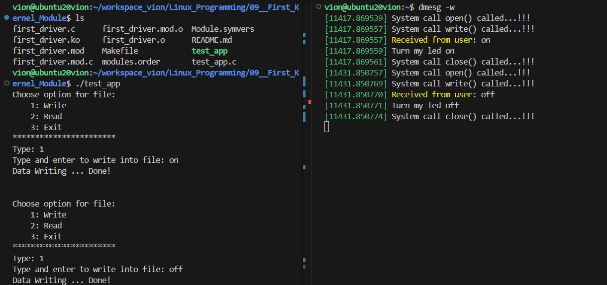

**BT9**. Create a Character Device Driver
*Description*:
- Create a **character device driver** (*kernel space*) that performs reading and writing data to the device file corresponding to that **character device driver**. Specifically:
    - Writing `on` to the device file will display the message `Turn my led on` in the kernel log.
    - Writing `off` to the device file will display the message `Turn my led off` in the kernel log.

---

*Answer*:
- There's also a test program [test_app.c](./test_app.c) to interact with the device file.
- Here's the result of running the test program:

