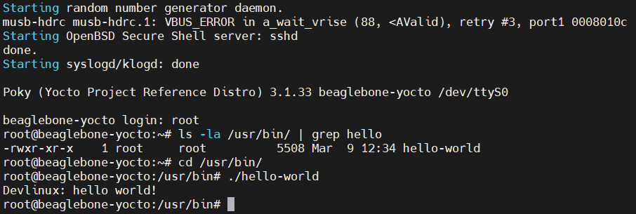

# Yocto Project on BeagleBone Black

## System Requirements
- A computer running Linux (Ubuntu, Fedora, etc.), in this case, Ubuntu 20.04 is used.
- BeagleBone Black board
- A microSD card (8GB or larger recommended), in this case, a 16GB card is used.

## Result
- Successfully booted the BeagleBone Black with the Yocto image:
.

## References
- [About Yocto Project - Devlinux](https://devlinux.vn/blog/Gi%E1%BB%9Bi-thi%E1%BB%87u-v%E1%BB%81-Yocto-Project)
- [Yocto on BeagleBone Black - beagleboard.org](https://www.beagleboard.org/projects/yocto-on-beaglebone-black)