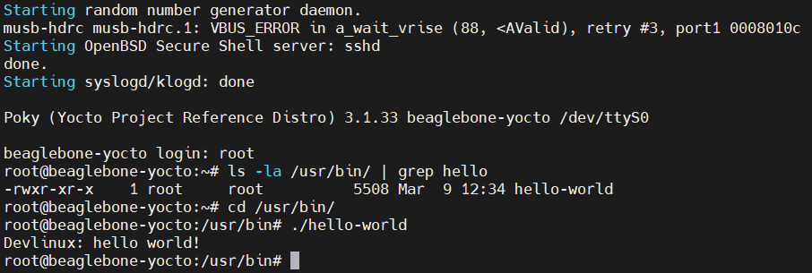
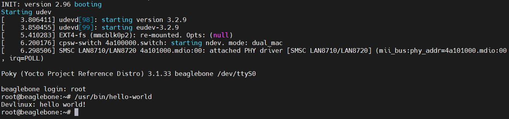
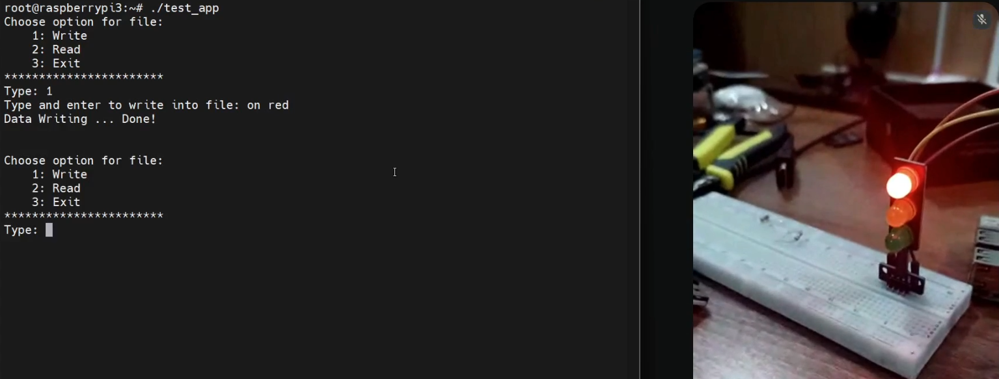

# Yocto Project on BeagleBone Black and Raspberry Pi 3 Model B

## 1. System Requirements
- A computer running Linux (Ubuntu, Fedora, etc.), in this case, *Ubuntu 22.04* is used.
- BeagleBone Black board or Raspberry Pi 3 Model B board
- A microSD card (8GB or larger recommended), in this case, a *16GB card* is used.

## 2. Results
### 2.1. Booted the BeagleBone Black with the Yocto image using **generic Yocto reference kernel** (`linux-yocto`):



<br>

### 2.2. Booted the BeagleBone Black with the Yocto image using **TI's kernel** (`linux-ti-staging`):



<br>

### 2.3. Booted the Raspberry Pi 3 Model B with the Yocto image, here's the running test app on the board:


<br>

### Note: Run the following command to verify which kernel recipe BitBake is actually using for the build:

```bash
bitbake -e virtual/kernel | grep ^PN=
```

## 3. References
- [About Yocto Project - Devlinux](https://devlinux.vn/blog/Gi%E1%BB%9Bi-thi%E1%BB%87u-v%E1%BB%81-Yocto-Project)
- [Yocto on BeagleBone Black - beagleboard.org](https://www.beagleboard.org/projects/yocto-on-beaglebone-black)
